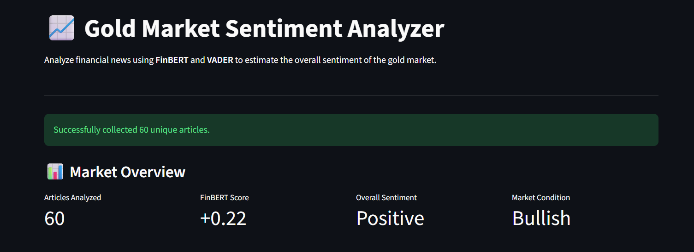
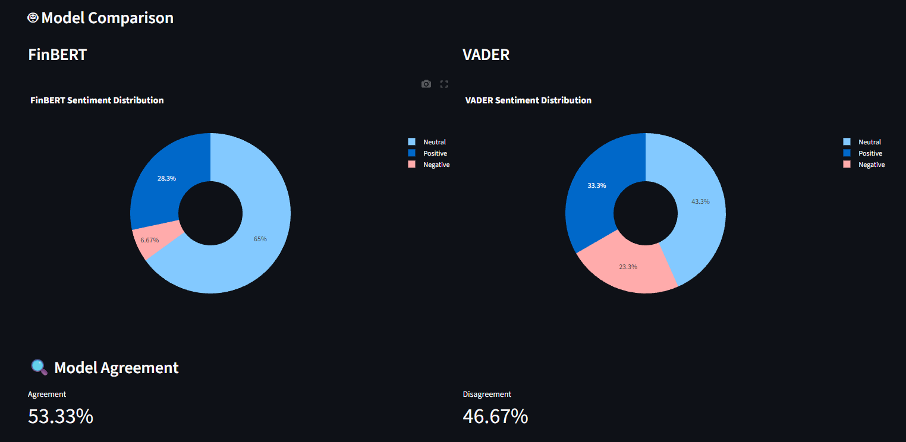
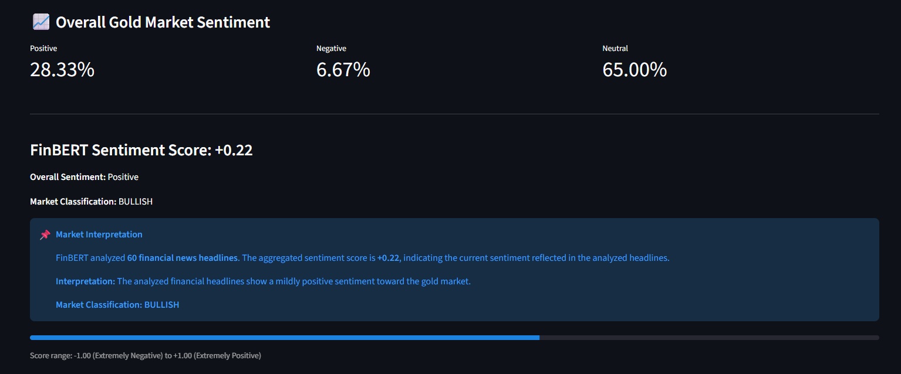

# 📈 Gold Market Sentiment Analyzer

An NLP-based financial news sentiment analysis system that collects gold-related financial news and analyzes market sentiment using **FinBERT** and **VADER**.

The system compares predictions from both sentiment models and presents the results through an interactive **Streamlit dashboard**.

---

## 🚀 Project Overview

Financial news can strongly influence investor perception of a market.

This project collects recent gold-related financial news and analyzes the sentiment expressed in the headlines to determine whether the overall news sentiment is:

- 🟢 Positive
- 🔴 Negative
- ⚪ Neutral

The system uses two different sentiment analysis approaches:

- **FinBERT** — A transformer-based language model specifically trained for financial text.
- **VADER** — A lexicon and rule-based sentiment analysis model.

The predictions from both models are compared to identify areas of agreement and disagreement.

The FinBERT predictions are also aggregated to calculate an overall market sentiment score and classify the market condition as **Bullish, Neutral, or Bearish**.

---

## ✨ Features

- 📰 Collects gold-related financial news using Google News RSS
- 🔎 Supports multiple financial search queries
- ♻️ Removes duplicate articles
- 🤖 Performs financial sentiment analysis using FinBERT
- 📊 Performs sentiment analysis using VADER
- 🔬 Compares predictions from both models
- 🤝 Calculates model agreement and disagreement
- 📈 Calculates an aggregated FinBERT sentiment score
- 🐂 Classifies the overall market condition as Bullish, Neutral, or Bearish
- 📊 Provides an interactive Streamlit dashboard
- 📋 Displays analyzed financial news in a table
- 💾 Allows analysis results to be downloaded as CSV
- 🗃️ Uses a local news cache when live news retrieval fails

---

## 🧠 Technologies Used

| Technology | Purpose |
|---|---|
| Python | Core programming language |
| FinBERT | Financial sentiment analysis |
| VADER | Rule-based sentiment analysis |
| Hugging Face Transformers | Loading and running FinBERT |
| PyTorch | Deep learning framework used by FinBERT |
| Feedparser | Parsing Google News RSS feeds |
| Requests | Fetching web pages |
| BeautifulSoup | Extracting article text |
| NumPy | Numerical processing |
| Pandas | Data processing and tabular results |
| Plotly | Interactive visualizations |
| Streamlit | Web dashboard |

---

## 🏗️ System Architecture

```text
                    ┌──────────────────────┐
                    │    Google News RSS   │
                    └──────────┬───────────┘
                               │
                               ▼
                    ┌──────────────────────┐
                    │    News Collection   │
                    │      Feedparser      │
                    └──────────┬───────────┘
                               │
                               ▼
                    ┌──────────────────────┐
                    │   Duplicate Removal  │
                    └──────────┬───────────┘
                               │
                               ▼
                    ┌──────────────────────┐
                    │    News Headlines    │
                    └──────────┬───────────┘
                               │
                    ┌──────────┴───────────┐
                    │                      │
                    ▼                      ▼
             ┌──────────────┐       ┌──────────────┐
             │   FinBERT    │       │    VADER     │
             │ Financial NLP│       │ Rule-based   │
             └──────┬───────┘       └──────┬───────┘
                    │                      │
                    └──────────┬───────────┘
                               ▼
                    ┌──────────────────────┐
                    │   Model Comparison   │
                    │  Agreement Analysis  │
                    └──────────┬───────────┘
                               │
                               ▼
                    ┌──────────────────────┐
                    │  Overall Sentiment   │
                    │ Score & Classification│
                    └──────────┬───────────┘
                               │
                               ▼
                    ┌──────────────────────┐
                    │ Streamlit Dashboard  │
                    └──────────────────────┘
```

---

## 📸 Application Screenshots

### 📊 Market Overview

The dashboard provides a quick overview of the analyzed financial news, including the number of articles, aggregated FinBERT sentiment score, overall sentiment, and market condition.



---

### 🤖 FinBERT vs VADER Comparison

The system compares the sentiment distributions generated by FinBERT and VADER and displays the agreement between the two models.



---

### 📈 Overall Gold Market Sentiment

The system aggregates the FinBERT predictions to calculate an overall sentiment score and classify the market condition.



---

## 🔄 How the System Works

### 1. 📰 News Collection

The system collects recent gold-related financial news using Google News RSS feeds.

Multiple search queries are used to improve the coverage of gold market news, such as:

- Gold market
- Gold price
- Gold news
- Gold trends
- Gold analysis
- Gold forecast
- Gold investment

The collected articles contain information such as the headline, publication date, and article URL.

### 2. ♻️ Duplicate Removal

Articles collected from different search queries may overlap.

The system removes duplicate articles so that the same news item is not analyzed multiple times.

### 3. 🤖 FinBERT Sentiment Analysis

Each financial news headline is analyzed using FinBERT.

FinBERT is a transformer-based NLP model designed specifically for financial text.

It classifies each headline as:

- 🟢 Positive
- 🔴 Negative
- ⚪ Neutral

The model also provides a confidence score for its prediction.

### 4. 📊 VADER Sentiment Analysis

The same headlines are also analyzed using VADER.

VADER is a lexicon and rule-based sentiment analysis approach that calculates a polarity score between **-1 and +1**.

The score is converted into:

- Positive
- Negative
- Neutral

### 5. 🔬 Model Comparison

The predictions from FinBERT and VADER are compared for every analyzed article.

The dashboard calculates:

- Model agreement
- Model disagreement
- FinBERT sentiment distribution
- VADER sentiment distribution

This helps evaluate how differently the two sentiment analysis approaches interpret financial news.

### 6. 📈 Overall Market Sentiment

The individual FinBERT predictions are aggregated to calculate an overall sentiment score.

Based on this score, the system classifies the overall gold market sentiment as:

- 🐂 **Bullish**
- ⚪ **Neutral**
- 🐻 **Bearish**

### 7. 🖥️ Streamlit Dashboard

The final results are presented through an interactive Streamlit dashboard.

The dashboard provides:

- Market overview
- FinBERT vs VADER comparison
- Model agreement statistics
- Overall market sentiment
- Analyzed news articles
- CSV download functionality

---

## ⚙️ Installation & Setup

### 1. Clone the repository

```bash
git clone https://github.com/pratyush1919/Financial-News-Sentiment-Analyzer.git
cd Financial-News-Sentiment-Analyzer
```

### 2. Create a virtual environment

```bash
python -m venv .venv
```

### 3. Activate the virtual environment

**Windows:**

```bash
.venv\Scripts\activate
```

**macOS / Linux:**

```bash
source .venv/bin/activate
```

### 4. Install dependencies

```bash
pip install -r requirements.txt
```

The required Python libraries include:

- Streamlit
- Transformers
- PyTorch
- VADER Sentiment
- Feedparser
- BeautifulSoup
- Pandas
- NumPy
- Plotly
- Requests